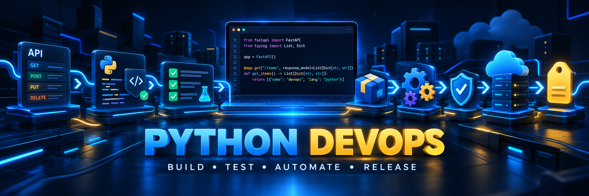

<div align="center">



# ⚙️ Python DevOps Engineering

**Building reliable Python software through automation, testing, packaging and continuous delivery.**

<p>
  
  
  
  
  
</p>

</div>

---

## 🚀 About this section

This section documents my progression from writing standalone Python programs to developing reliable, testable, distributable and automated software.

The projects apply DevOps principles throughout the complete Python development lifecycle: communicating with external services, writing robust typed code, testing behavior automatically, organizing professional packages, enforcing quality gates and automating releases.

Every concept is reinforced through original projects designed to turn technical theory into working software with clear documentation, reproducible environments and verifiable results.

---

## 🎯 What this section develops

- Reliable communication with REST APIs.
- Defensive programming and structured exception handling.
- Static typing for safer and more understandable code.
- Automated testing with Pytest.
- Mocking external services and isolating dependencies.
- Professional Python project organization.
- Dependency and package management.
- Command-line application development.
- Continuous Integration and Continuous Delivery.
- Automated quality and security checks.
- Reproducible software installation and execution.
- Automated package publishing and versioned releases.
- Clean Git and GitHub development workflows.

---

## 🌐 HTTP APIs and resilient clients

The first stage focuses on building Python applications that communicate reliably with external services.

Topics include:

- HTTP methods such as `GET` and `POST`.
- Query parameters.
- Request headers.
- JSON serialization and deserialization.
- Bearer token authentication.
- HTTP Basic Authentication.
- Environment variables.
- Secret management.
- HTTP status codes.
- `raise_for_status()`.
- Connection errors.
- Request exceptions.
- Explicit timeouts.
- Fixed retry strategies.
- Exponential backoff.
- Random jitter.
- Recovery from temporary server failures.

The objective is to build clients that behave predictably when networks and external services fail.

---

## 🧩 Robust code with static typing

Projects progressively introduce type information to make interfaces clearer and detect mistakes before execution.

Topics include:

- Function parameter types.
- Return types.
- Typed collections.
- `Union` and `Optional`.
- `TypedDict`.
- Typed classes and methods.
- Generic types.
- Constrained values.
- Decorators.
- Iterators.
- Static analysis with Pylance.
- Type checking as an automated quality gate.

Type hints are treated as part of the software design rather than decorative annotations.

---

## 🧪 Automated testing

Projects evolve from manual verification toward reliable and repeatable automated tests.

Testing practices include:

- Assertions.
- Testing expected exceptions.
- Happy paths.
- Failure paths.
- Edge cases.
- Invalid inputs.
- Test-driven development principles.
- Parametrized tests.
- Reusable fixtures.
- Dependency isolation.
- API mocks.
- `monkeypatch`.
- Deterministic retry testing.
- Authentication and timeout testing.

External services are mocked when appropriate so tests remain fast, stable and independent from network availability.

---

## 📦 Professional Python projects

This section explores how Python applications grow beyond individual scripts.

Engineering practices include:

- Separating responsibilities across modules.
- Creating reusable packages.
- Managing imports cleanly.
- Using a dedicated application entry point.
- Organizing code with a `src` layout.
- Defining projects through `pyproject.toml`.
- Managing runtime and development dependencies.
- Creating reproducible environments.
- Building source distributions.
- Building Python wheels.
- Installing packages in clean environments.
- Creating reusable command-line tools.
- Versioning software releases.

The objective is for every larger project to behave like maintainable software instead of a collection of unrelated scripts.

---

## 🖥️ Command-line applications

CLI projects provide structured interfaces for automation and developer workflows.

Concepts include:

- Commands and subcommands.
- Arguments and options.
- Input validation.
- Exit codes.
- Help messages.
- Configuration through environment variables.
- Human-readable terminal output.
- Automation-friendly execution.
- CLI development with Click.

---

## 🔄 CI/CD and release automation

Projects integrate automated pipelines that validate each important change.

The delivery workflow follows this progression:

```text
Code
  ↓
Lint
  ↓
Type Check
  ↓
Security Check
  ↓
Automated Tests
  ↓
Package Build
  ↓
Publish
  ↓
Versioned Release
```

CI/CD topics include:

- GitHub Actions workflows.
- Workflow triggers.
- Jobs and steps.
- Dependency installation.
- Dependency caching.
- Automated linting.
- Static type checking.
- Test execution.
- Security checks.
- Package building.
- Publishing to TestPyPI.
- Publishing to PyPI.
- Trusted publishing with OIDC.
- Semantic versioning.
- Semantic Release.
- Automated changelogs.
- Automated GitHub releases.

A failed quality gate prevents unreliable code from advancing through the pipeline.

---

## 🛠️ Engineering lifecycle

| Stage | Main focus |
|---|---|
| Build | Modular Python applications and CLI tools |
| Connect | APIs, authentication, JSON and external services |
| Protect | Timeouts, exceptions, retries and secret management |
| Type | Explicit interfaces and static analysis |
| Test | Pytest, fixtures, parametrization and mocks |
| Package | `pyproject.toml`, dependencies and distributable builds |
| Automate | GitHub Actions and quality gates |
| Release | Versioning, publishing and automated delivery |

---

## 🛰️ Featured project

### [Resilient GitHub Repo Scout](./resilient-github-repo-scout/)

A modular CLI application that searches GitHub repositories and demonstrates:

- GitHub REST API integration.
- Bearer token authentication.
- HTTP Basic Authentication.
- Query parameters.
- JSON processing.
- Environment-based secret management.
- Request timeouts.
- Fixed retries.
- Exponential backoff.
- Random jitter.
- Client and server error handling.
- POST requests with JSON.
- Separation between configuration, interface and API clients.

This project establishes the foundation for the typing, testing, packaging and automation work developed throughout this section.

---

## 🔧 Technologies and tools

| Category | Technologies |
|---|---|
| Language | Python |
| HTTP | Requests, REST APIs, JSON |
| Configuration | Environment variables, python-dotenv |
| Typing | Type hints, TypedDict, generics, Pylance |
| Testing | Pytest, fixtures, parametrization, mocks |
| Packaging | pyproject.toml, wheels, PyPI |
| CLI | Click |
| Automation | GitHub Actions |
| Quality | Linting, type checking, security checks |
| Delivery | OIDC, Semantic Release, versioned releases |
| Version control | Git, GitHub Flow, branches and Pull Requests |

---

## 🌿 Development workflow

Projects follow a structured GitHub workflow:

```text
Issue
  ↓
Feature branch
  ↓
Implementation
  ↓
Local verification
  ↓
Commit
  ↓
Push
  ↓
Pull Request
  ↓
Automated checks
  ↓
Review
  ↓
Merge
```

This creates a visible history of how each project evolves and how problems are identified, tested and resolved.

---

## ✅ Project quality standards

Larger projects in this section are designed around the following standards:

- Clear separation of responsibilities.
- External secrets excluded from Git.
- `.env.example` files where configuration is required.
- Explicit project dependencies.
- Installation and execution instructions.
- Predictable exception handling.
- Type annotations.
- Automated tests.
- Mocked external integrations.
- Continuous Integration.
- Reproducible builds.
- Meaningful commits.
- Feature branches and Pull Requests.
- Technical documentation of decisions and limitations.

---

## 🧠 Learning approach

The objective is to understand the engineering decisions behind reliable software:

- Why every external request needs a timeout.
- Which failures should be retried.
- Why backoff and jitter protect recovering services.
- When mocks are preferable to live API calls.
- How typing improves communication between modules.
- Why automated tests must cover failures as well as successful cases.
- How packaging and dependency management improve reproducibility.
- How automated checks protect the main branch.
- How a local Python project becomes a versioned release.

The projects emphasize implementation, debugging and progressive improvement rather than isolated syntax practice.

---

## 🏁 Outcome

This section represents the transition from learning Python as a programming language to using Python as an engineering and automation tool.

By combining APIs, typing, testing, packaging and delivery automation, these projects establish a practical foundation for:

- DevOps
- MLOps
- Backend engineering
- Cloud automation
- Reliable AI systems
- Production-oriented Python development

---

<div align="center">

**Build reliable software. Test every assumption. Automate the path to release.**

</div>